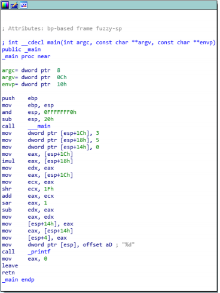
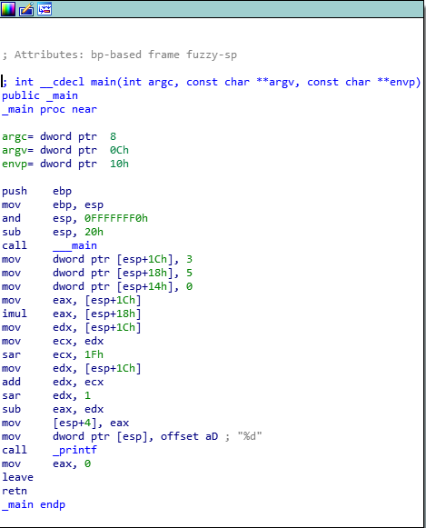
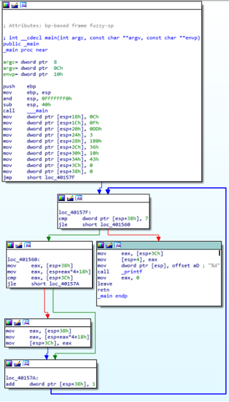
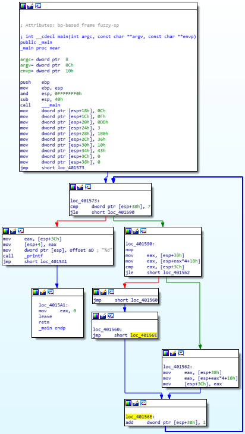
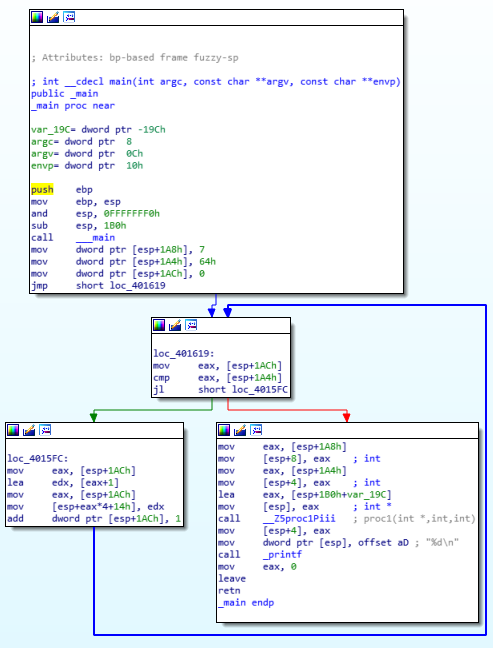
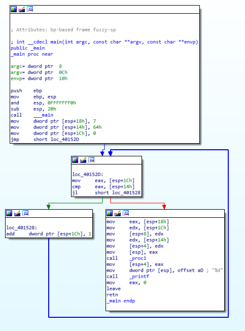

Question 1 (Reverse Engineering):

The presented code follows the basic below logic:

- Define three integers (3,5,0)
- Multiply 3*5
- Subtract the result of a bit-shifting operation from the above product.

My resulting code was as follows:

```#include <stdio.h>

int main()
{
    // Define 3 integers
    int a = 3;
    int b = 5;
    int c = 0;

    // Subtract the a right-shifted value of integer a from the product of a and b.
    // Print the result.
    printf("%d", ((a * b) - (((a>>31)+a)>>1)));
    return 0;
}
```

Although I was not able to perfectly match the original functionality - I do belive the operation is similar.

The decomilation of my program resulted in the following comparision:

 

Question 2 (Reverse Engineering):

The presented code follows the basic below logic:

- Define an array of integers, and two counter variables.
- If the second counter variable is less than 7, and the value matching array{counter2} is less than counter1, increment counter 2
- Otherwise print counter 1 and end the program.

The decomilation of my program resulted in the following comparision:

 

Question 4 (Decompiliation & Reverse Engineering):

The provided exe outputs the number 50 to standard output when run, and has the following structure when decompiled:



It's basic structure was as follows:

- Define 3 variables (integers 7, 100, 0)
- Enter a while loop dependent on the third integer being less than the second (100)
- During this while loop increment the third integer.
- Pass these integers off to a secondary function.
- The secondary function performs unknown operations (???).
- The resulting integer (50) is the printed to the screen.

I was able to match the majority of the primary program's logic, but have yet to understand the secondary function that is called.


