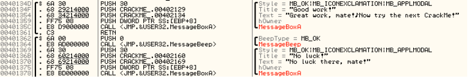
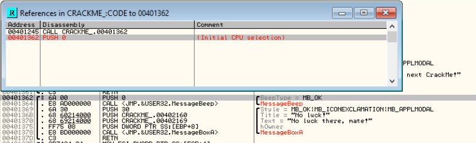

Question 1 - Alter Program Behavior:

Normally, the CrackMe software compares a given name to a given serial number. If the two values equate (given some unknown internal algorithm), the user is presented with a success message. Otherwise, the user is presented witha denial message.

Our goal is to change the program so that, even when incorrect credentials are entered, the behavior for a successful case (the message box stating "Great work, mate!") is still displayed.

This is simple enough. First we have to determine what logic is triggering the rejection message. To do that we find the rejection message in the diassembled code, and analyze its calling function:

