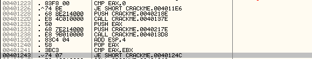

Question 1 - Alter Program Behavior:

Normally, the CrackMe software compares a given name to a given serial number. If the two values equate (given some unknown internal algorithm), the user is presented with a success message. Otherwise, the user is presented witha denial message.

Our goal is to change the program so that, even when incorrect credentials are entered, the behavior for a successful case (the message box stating "Great work, mate!") is still displayed.

This is simple enough. First we have to determine what logic is triggering the rejection message. To do that we find the rejection message in the diassembled code, and analyze its calling function:

We then simply re-write the calling instruction to load the desired messagebox instead:

Now, any name entered with any serial number will be evaluated as a successful combination. The modified binary is labeled CRACKME_CRACKED_BINARY.exe

--

Question 2 - Determine Credential Auditing Algorithm:

The first step in determining how serial numbers are matched to names is to find what calls the successfull message box.

So it appears that the last step in the algorith is to check if EAX and EBX registers are equal - so now we know where to look for modification of data.

If we follow the calls before this comparison we notice more interesting information:

It seems that our codified name is being XOR'd with 1234 to give us our serial value - which is later compared to the user input.

Now we know how the serial is calculated, we just have to determine what modifications the name undergoes (if any) before this XOR step.

After digging through some function calls, it becomes apparent that we are paying attention to the ASCII values of the charecters in our username - specifically their sum.

Putting together what we know, the algorith for the cserialization of a username is as follows:

- Get username from user (ASCII Representation)
- Convert username to uppercase (ASCII Representation)
- Sum ASCII representation of username
- XOR summation with 1234
- COmpare calculated serial with user input

So, for example, the following would be username-serial pairs:

JOSH: 17784
