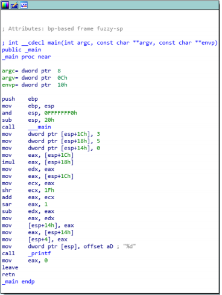
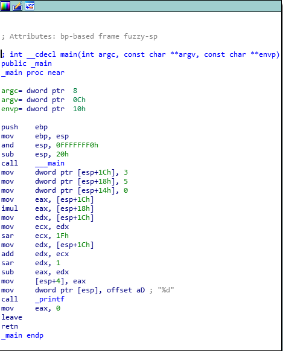

Question 1 (Reverse Engineering):

The presented code follows the basic below logic:

- Define three integers (3,5,0)
- Multiply 3*5
- Subtract the result of a bit-shifting operation from the above product.

My resulting code was as follows:

```#include <stdio.h>

int main()
{
    // Define 3 integers
    int a = 3;
    int b = 5;
    int c = 0;

    // Subtract the a right-shifted value of integer a from the product of a and b.
    // Print the result.
    printf("%d", ((a * b) - (((a>>31)+a)>>1)));
    return 0;
}
```

Although I was not able to perfectly match the original functionality - I do belive the operation is similar.

The decomilation of my program resulted in the following comparision:



